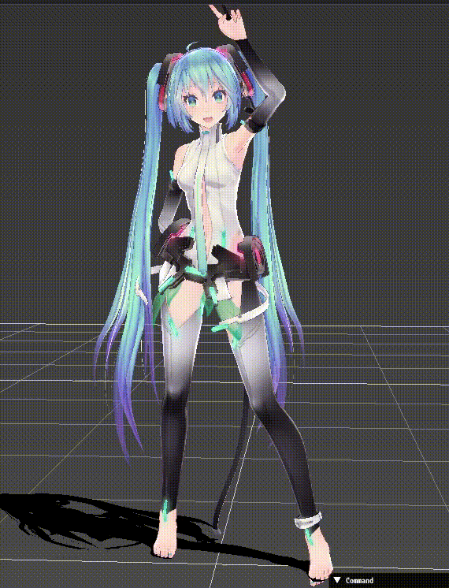

[ja](./README.ja.md)

# Saba.Build

Build MMD read library saba

# DEMO



# Requirement

* <time datetime="2020-04-27T09:38:59+0900">2020-04-27</time>
* [Raspbierry Pi](https://ja.wikipedia.org/wiki/Raspberry_Pi) 4 Model B Rev 1.2
* [Raspbian](https://ja.wikipedia.org/wiki/Raspbian) buster 10.0 2019-09-26 <small>[setup](http://ytyaru.hatenablog.com/entry/2019/12/25/222222)</small>
* bash 5.0.3(1)-release

# Usage

```sh
git clone https://github.com/ytyaru/Saba.Build.20200427093906
cd Saba.Build.20200427093906/src
./run.sh
```

1. Drag and drop the downloaded `pmd` (` pmx`) or `vmd` file.
1. Adjust the camera with mouse movement and wheel
1. Click `Control` →` Animation` → `Play` on the left side of the screen
1. Start dancing

# Author

ytyaru

* [](https://github.com/ytyaru "github")
* [](http://ytyaru.hatenablog.com/ytyaru "hatena")
* [](https://mstdn.jp/web/accounts/233143 "mastdon")

# License

This software is CC0 licensed.

[](http://creativecommons.org/publicdomain/zero/1.0/deed.en)

The MMD model uses the following. Thanks.

* https://bowlroll.net/file/4576

The vmd uses the following. Thanks.

* https://bowlroll.net/file/2328

[Saba] (https://github.com/benikabocha/saba) to build. Thanks.

